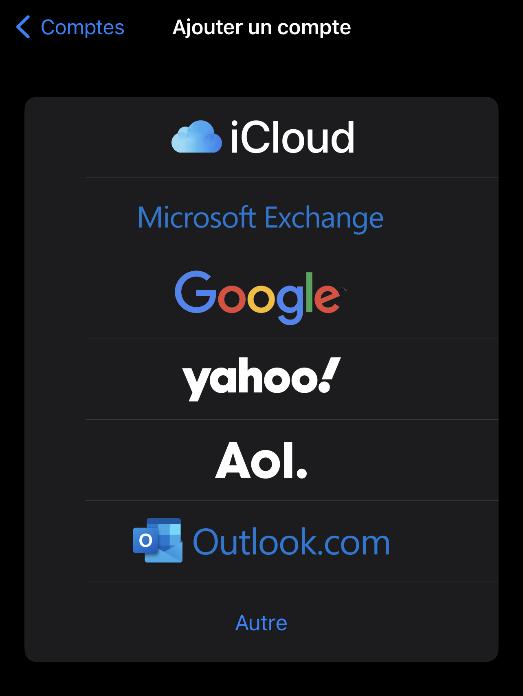
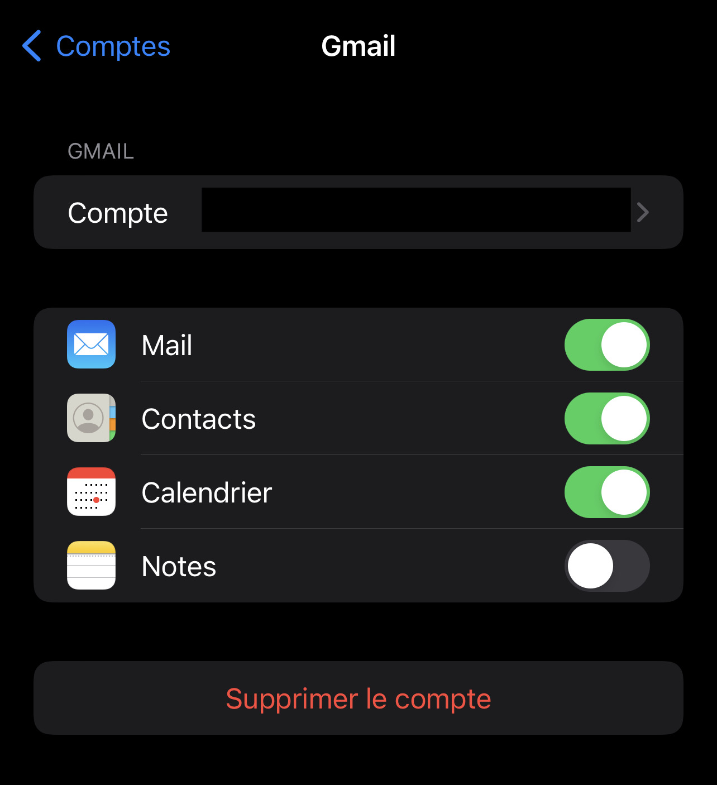
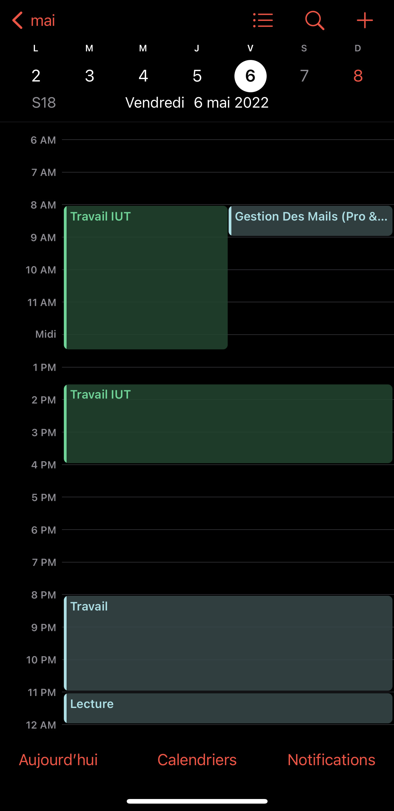
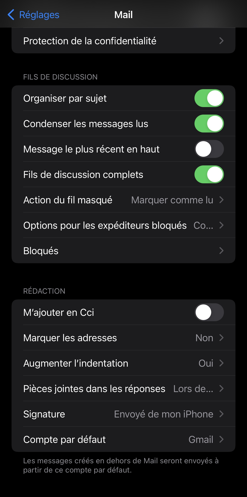

# Synchroniser tous les calendriers Google sur iPhone

La synchronisation de votre calendrier Google par défaut ou de vos 
calendriers personnalisés sur votre iPhone est assez simple ces derniers 
jours sur iOS. Une fois que vous avez ajouté votre compte Gmail sous 
Mail, vous avez la possibilité de synchroniser votre calendrier, vos 
contacts et vos notes.

Toutefois, si vous avez déjà ajouté à Google des calendriers tiers, 
c'est-à-dire ceux qui s'affichent sous Autres agendas, vous avez 
peut-être remarqué qu'ils ne sont pas synchronisés automatiquement sur 
l'iPhone.

Ce problème m'a frustré pendant longtemps avant que je sois capable de le 
comprendre. Dans cet article, je vais vous montrer rapidement comment 
activer la synchronisation de calendrier normale avec Google dans iOS, 
puis comment synchroniser les autres calendriers que vous pourriez avoir.

## Sections : 

1. [Synchroniser Google Agenda avec l'iPhone](#synchroniser-google-agenda-avec-liphone)

---
## 1. Synchroniser Google Agenda avec l'iPhone

C'est très simple et facile à faire. Tout d'abord, allez dans **Paramètres** et appuyez sur **Mail**. Ensuite allez dans **Comptes** et choisissez votre **calendrier**.
Si vous n'avez pas encore ajouté votre compte, appuyez sur **Ajouter un compte**.

> Attention !  le compte iCloud correspond à l'adresse mail avec la qu'elle vous avez configuré l'iPhone. Si c'est cette adresse qui vous intéresse cliquez sur Gmail.
 

 
    

 

Appuyez sur **Google**, puis vous serez invité à entrer votre adresse 
e-mail Gmail. Appuyez sur **suivant** et vous devrez entrer votre mot de passe. 
Appuyez sur **suivant** et si tout se connecte correctement, vous verrez les options pour synchroniser le courrier, les contacts, les calendriers, etc.

     
    

Si vous avez seulement besoin de synchroniser les calendriers, désactivez tout le reste. Appuyez sur **Enregistrer** et vous êtes prêt à partir. Notez que les seuls calendriers qui seront synchronisés sont ceux répertoriés sous **Mes agendas** lorsque vous accédez à calendar.google.com sur votre bureau.

     
    

Maintenant, ouvrez l'application de calendrier sur votre téléphone et vous devriez voir tous les rendez-vous de ces calendriers répertoriés sous **Calendriers** . Avant de commencer à synchroniser les autres calendriers, permettez-moi de vous donner un dernier conseil.

Allez dans **Paramètres**, appuyez sur **Mail** puis faites défiler jusqu'à **Calendrier par défaut** . Ici, vous pouvez choisir votre calendrier Google principal par défaut, de sorte que lorsque vous créez de nouveaux événements sur votre iPhone, ils seront créés dans le calendrier Google plutôt que dans le calendrier iCloud.

     
    

